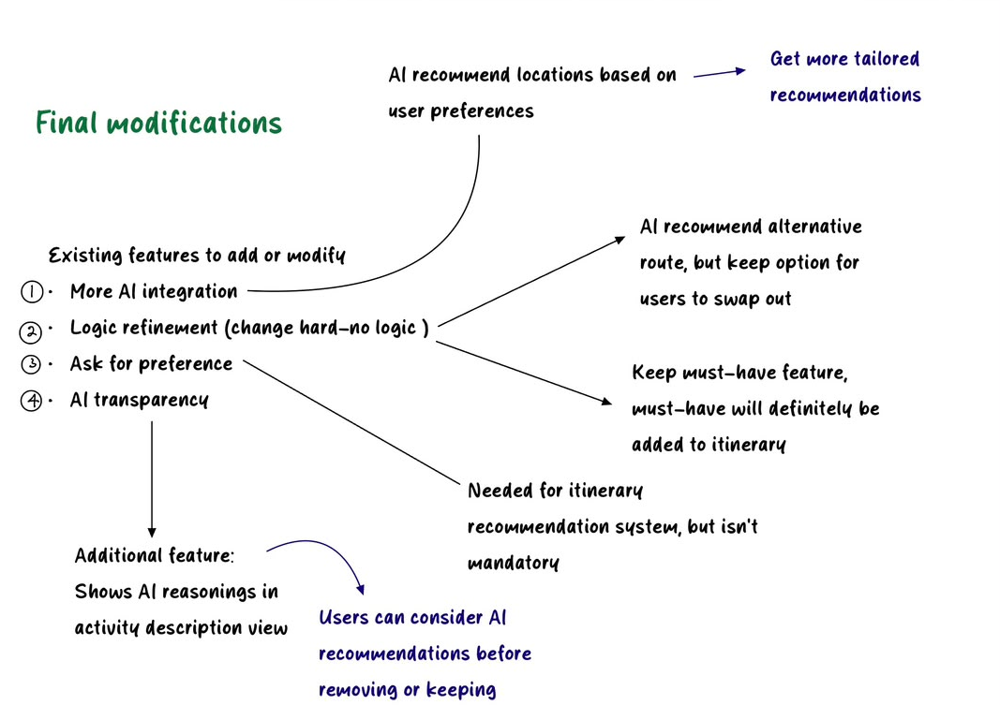
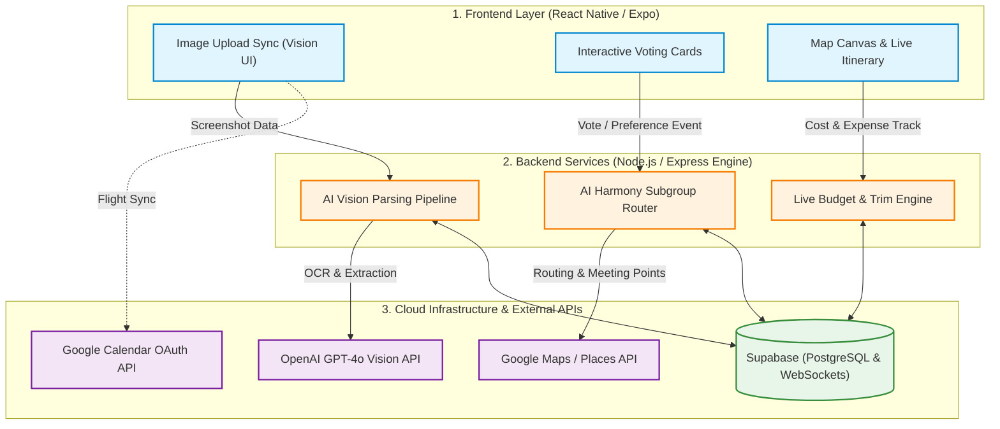

# Pocket Trip by The Last 4

**Team:** Kam Pue Shan, Faustina Lai Wan Yee, Tan Wen Jie, Tang Xin Yee  
**Problem Statement:** Lifestyle Track: Planning an Escape (Travel Planner)  
**Video Presentation:** https://youtu.be/dYDMV80upG0  
**Presentation Slides:** https://canva.link/y4avz1u1hwqz0h3 

---

## 1. Project Overview

### The Problem
Group travel planning is notoriously friction-filled, often devolving into endless group chat debates, budget misunderstandings, and logistics headaches. Through user research and problem-tree analysis, we identified four root causes behind this breakdown:

1. **Unrealistic & Conflicting Budgets**: Users often lack local market cost awareness (e.g., seasonal price surges). Traditional budget sliders without intelligent price floors lead to impossible expectations (e.g., trying to accommodate a RM 1000 traveler and a RM 200 traveler on the same trip). Furthermore, traditional apps fail to let users choose *where* to trim costs (e.g., accommodation vs. dining), leading to poor overall travel experiences.
2. **Subgroup Explosion & Over-Customization**: Allowing unlimited "wants" and "dislikes" gives every preference equal weight. This causes an explosion of tiny, isolated subgroups, fragmenting the travel group and destroying the shared experience.
3. **Asynchronous Onboarding Bottlenecks**: Travel groups usually consist of proactive planners and passive participants. When tools require *every* member to complete preference questionnaires before generating an itinerary, a single "Pending" member stalls the entire group.
4. **Flight Schedule Asymmetry**: Group members rarely arrive on the exact same flight or at the same time. Fixed timelines fail to accommodate staggered arrival and departure windows.

#### Stakeholders
* **The Designated Trip Leader**: Takes on the burden of organizing, budgeting, and managing schedules while trying to keep everyone happy.
* **Passive / Casual Group Members**: Want a fun trip without spending hours filling out surveys or managing logistics.
* **Budget-Conscious Travelers**: Need strict, transparent cost tracking without being forced into ultra-low-quality accommodation or food options.
* **Families & Parents**: Require location updates and peace of mind without invasively tracking young adult travelers 24/7.

#### Existing Market Solutions & Their Shortcomings
* **Wanderlog**: Offers comprehensive itinerary building but relies heavily on text-heavy manual searches, link pasting, and manual drag-and-drop scheduling. It functions as a digital notebook rather than an active assistant and lacks non-confrontational conflict resolution tools.
* **TripIt**: Excellent for consolidating flight and hotel confirmation emails, but fails completely at group collaboration, social media inspiration ingestion, real-time in-trip adaptation, and dynamic budget mediation.

---

### Our Solution
**Pocket Trip AI** is an AI-native group travel platform that transforms travel planning from a tedious logistical task into a fluid, adaptive experience. Instead of forcing rigid questionnaires or enforcing hard majority votes, Pocket Trip AI leverages passive AI profiling, multimodal visual parsing, and continuous budget monitoring to orchestrate trips effortlessly. When group preferences diverge, the app's AI engine automatically generates non-confrontational, parallel micro-routes with automated reunion anchors, allowing members to explore independently for short intervals before seamlessly regrouping.

#### Key Feature Set
* **AI Vision Social Inspo Parser**: Allows users to bulk-upload screenshots from Xiaohongshu, Instagram, or TikTok. OpenAI GPT-4o Vision automatically extracts attraction names, category tags, opening hours, and estimated per-person costs.
* **Asynchronous Google Calendar Flight Sync**: Auto-detects arrival/departure windows via Google Calendar OAuth, automatically locking out unavailable time slots and building buffer periods around arrivals.
* **AI Harmony Hub & Controlled Subgroup Micro-Loops**: Eliminates harsh rejection buttons. To prevent subgroup explosion, users are granted a maximum of **1 Dislike per day**. When preferences split, AI generates temporary 45-minute parallel routes within 300 meters of each other and designates an automated reunion anchor (e.g., a nearby dessert café).
* **Transparent AI Rationale Engine**: Displays explicit "Why AI Suggested This" contextual tags (factoring in peak heat hours, travel distance, and group vibe) for full transparency.
* **Live Budget Bar & Selective AI Budget Trim**: Real-time spending tracker displaying per-pax financial health. Instead of forcing cheap alternatives across the board, AI allows users to choose specific areas to trim costs (e.g., swapping a high-end dinner while keeping a preferred stay).
* **Real-Time Disruption Management Agent**: Allows travelers to report delays or bad weather mid-trip. The AI instantly reorganizes remaining daily stops to protect mandatory highlights.
* **Privacy-Preserving Parent View**: Generates warm, AI-summarized trip updates and high-level progress digests for parents without exposing raw, intrusive real-time GPS coordinates.

---
## 2. Ideation & Process

### 2.1 Ideas We Considered

| Idea | Status | Why it was kept / dropped |
| :--- | :--- | :--- |
| **AI Subgroup Micro-Loops & 1 Dislike/Day Threshold** | **Chosen** | **Kept**: Replaces harsh splits with parallel pathways. Enforces a cap of 1 Dislike per day to prevent subgroup explosion caused by unlimited "wants" and "don'ts". |
| **Social Media Screenshot Parsing (AI Vision)** | **Chosen** | **Kept**: Eliminates manual text entry by extracting venue names and price estimates directly from uploaded social media images using GPT-4o Vision[cite: 2]. |
| **Dynamic Live Budget Bar & Selective AI Trim** | **Chosen** | **Kept**: Solves the problem of "zero-floor" sliders and market cost ignorance[cite: 1, 2]. Allows members with drastically different budgets (e.g., RM 1000 vs. RM 200) to selectively trim specific cost areas (e.g., food vs. stays). |
| **Leader-Only Edit Authority with Micro-Votes** | **Chosen** | **Kept**: Prevents itinerary clutter and accidental overrides caused by unrestricted multi-user editing[cite: 2], while allowing lightweight voting cards in chat. |
| **Passive AI Profiling (Default "Follower" Mode)** | **Chosen** | **Kept**: Eliminates group onboarding bottlenecks caused by waiting for "Pending" members to complete forms before generating an itinerary draft[cite: 2]. |
| **Google Calendar Flight Sync Integration** | **Chosen** | **Kept**: Solves flight schedule asymmetry where group members arrive on different flights or at different times[cite: 2]. |
| **In-App Shared Photo Album** | **Dropped** | **Dropped**: Removed following mentor feedback to keep the app lightweight and strictly focused on dynamic coordination, scheduling, and budget optimization. |
| **Mandatory Upfront Group Preference Questionnaire** | **Dropped** | **Dropped**: Rejected because requiring every member to complete questionnaires upfront wasted time waiting for inactive/pending users and stalled group progress[cite: 2]. |
| **Zero-Floor Budget Sliders & Fixed Group Budgeting** | **Dropped** | **Dropped**: Dropped because forcing the lowest group budget or using unconstrained sliders created completely unrealistic trip plans that ignored local seasonal costs. |

---

### 2.2 Ideation Boards

To design Pocket Trip AI, our team conducted a root-cause breakdown of group travel friction, audited the flaws in our initial prototype, and systematically filtered ideas using a How Might We (HMW) framework.

#### 1. Root-Cause Analysis (Problem Tree)

*Figure 2.1: Problem Tree Mapping — Tracing how unprioritized preferences, zero-floor budget sliders, and market cost ignorance directly lead to member friction and plan abandonment.*

* **Preference Overload**: Allowing unlimited "wants" and "don'ts" without prioritization creates niche activity combinations and tiny, isolated subgroups.
* **Budget Irreconcilability**: Traditional zero-floor budget sliders ignore local seasonal costs. This makes it impossible to accommodate members with drastically different financial means (e.g., RM 1000 vs. RM 200), leaving users unable to choose *where* to cut costs (e.g., dining vs. accommodation).
* **Core Downstream Impact**: Friction and disagreements between members, low user conversion, and dissatisfaction from being locked into disliked, low-quality activities.

---

#### 2. First Draft Prototype Audit & Pain Points

*Figure 2.2: Initial Flow Critiques — Identifying onboarding bottlenecks caused by pending members, uncoordinated flight arrival times, and unmoderated editing rights.*

* **Onboarding Bottlenecks**: Requiring upfront preference forms created severe delays whenever inactive group members remained in a "Pending" state.
* **Flight Schedule Asymmetry**: Group members rarely arrive on the same flight or at the same time, rendering static, un-synced schedules unusable.
* **Unrestricted Editing Clutter**: Allowing any member to edit created overloaded activity lists without accommodating individual preferences or budget limits.

---

#### 3. How Might We (HMW) & Idea Selection Board

*Figure 2.3: Ideation & Selection Board — Mapping HMW questions across Preferences, Budget, and Engagement, evaluating trade-offs, and selecting our final feature set.*

##### Preference Control
* **Explored & Dropped**: Leader-only picks were rejected as unfair; mandatory voting on every item stalled progress.
* **Final Pick**: Granted each member a set of must-have locations and a strict limit of **1 Dislike per day** to bound subgroup branching without social friction.

##### Budget Flexibility
* **Explored & Dropped**: Forcing the group to follow the lowest budget was deemed unfair to higher spenders; categorizing members into budget subgroups fragmented the trip.
* **Final Pick**: Display total estimated budget upfront and allow users to selectively trim costs in specific categories (e.g., lodging vs. food).

##### Engagement & Input
* **Explored & Dropped**: Direct in-app booking was dropped as an unrealistic build scope.
* **Final Pick**: Integrated an **AI Chatbot** for instant conversational edits, nearby stay recommendations with price estimates, and an **Inspo Image Parser** to extract locations directly from uploaded social media screenshots.

---

#### 4. Final Modifications & Technical Refinement Mindmap

*Figure 2.4: Refinement Mindmap — Synthesizing mentor feedback into concrete system adjustments across AI touchpoints, logic refinements, non-mandatory preferences, and transparency.*

* **Expanded AI Integration**: Shifted to personalized location recommendations based on user preferences for tailored itinerary planning.
* **Logic Refinement (Replacing Hard-No)**: Replaced rigid rejection modals with AI-recommended alternative routes (keeping user swap options intact) while guaranteeing that "Must-Have" locations are strictly preserved in the schedule.
* **Non-Mandatory Preferences**: Preference inputs feed the recommendation system without being forced upfront, eliminating onboarding delays for passive members.
* **AI Transparency & Rationale**: Integrated explicit AI explanations into the Activity Description view, enabling users to understand AI reasoning before deciding whether to keep or swap stops.

---

### 2.3 Mentor Consultation

<table>
  <thead>
    <tr>
      <th>Date</th>
      <th>Mentor</th>
      <th>Feedback Received</th>
      <th>What Was Changed / Team Rationale</th>
    </tr>
  </thead>
  <tbody>
    <!-- Session 1: Zach Khong -->
    <tr>
      <td rowspan="5"><b>07/09/2026</b></td>
      <td rowspan="5">Zach Khong</td>
      <td><b>1. Feature Scope</b> Remove the Photo Album feature to keep focus sharp.</td>
      <td><b>Agreed & Implemented</b> Removed Photo Album module entirely.</td>
    </tr>
    <tr>
      <td><b>2. Flight Sync</b> Sync flight schedules via Google Calendar integration.</td>
      <td><b>Agreed & Implemented</b> Integrated Google Calendar OAuth for flight availability.</td>
    </tr>
    <tr>
      <td><b>3. Governance</b> Assign sole editing authority to a designated Trip Leader.</td>
      <td><b>Agreed & Implemented</b> Restructured permissions to Leader-only edit model.</td>
    </tr>
    <tr>
      <td><b>4. Onboarding Friction</b> Solve flow blockages caused by unresponsive group members.</td>
      <td><b>Agreed & Implemented</b> Implemented AI auto-completion defaults for inactive users.</td>
    </tr>
    <tr>
      <td><b>5. Conflict Resolution</b> Provide split pathways or compromise spots for conflicting preferences.</td>
      <td><b>Agreed & Implemented</b> Replaced hard splits with 45-minute parallel subgroup loops and automated reunion points.</td>
    </tr>
    <!-- Session 2: Mah Qing Fung -->
    <tr>
      <td rowspan="4"><b>11/09/2026</b></td>
      <td rowspan="4">Mah Qing Fung</td>
      <td><b>1. AI Integration Depth</b> Increase AI touchpoints across all key screens.</td>
      <td><b>Agreed & Implemented</b> Added AI Vision parsing, proactive AI budget guardrails, and AI disruption agents.</td>
    </tr>
    <tr>
      <td><b>2. Logic Refinement</b> Remove hard-coded "Hard-No" mechanics; let AI mediate decisions dynamically.</td>
      <td><b>Agreed & Implemented</b> Replaced Hard-No modals with soft AI Harmony arbitration.</td>
    </tr>
    <tr>
      <td><b>3. User Onboarding</b> Force users to complete preference and budget forms upfront.</td>
      <td><b>Disagreed & Omitted Upfront Forms</b> Opted for passive AI profiling and dynamic screenshot budget parsing instead to prevent onboarding bottlenecks.</td>
    </tr>
    <tr>
      <td><b>4. AI Transparency</b> Add explicit AI explanations for schedule choices and pre-swap recommendations.</td>
      <td><b>Agreed & Implemented</b> Added "Why AI suggested this" rationale tags and AI Smart Swap modals.</td>
    </tr>
  </tbody>
</table>

## 3. Design & Prototype

**UI Prototype:** https://www.figma.com/design/Vd08aJCY0ix9kyV9NJg8pR/UI-Prototype-Pocket-Trip?node-id=2009-632&t=7SCQYwLwL8Ws1qtk-1

### Key Screen Breakdowns

*Figure 3.1: Homepage & Trip Setup (`Create_Step1` & `Create_Step2`) — The Leader initializes the trip, syncs flight schedules via Google Calendar, and selects overarching "Trip Vibes" (e.g., Chill & Cafe, Food Hunt). Passive group members can join instantly without filling out tedious questionnaires.*

---

*Figure 3.2: Multimodal Social Inspo Parsing (`Image Recognition 1 & 2`) — Group members drop screenshots from Instagram, TikTok, or Xiaohongshu. GPT-4o Vision processes the images, extracts venue names, categorizes spots (Must-See vs. Nice-to-Have), and calculates estimated costs.*

---

*Figure 3.3: Master Itinerary & AI Rationale (`Itinerary 2nd Draft` & `Activity Desc`) — Displays the optimized itinerary timeline. Tapping any attraction reveals a modal with an explicit "Why AI Suggested This" section detailing timing, heat avoidance, and budget optimization rationale.*

---

*Figure 3.4: Subgroup Micro-Loops (`Subgroup Itinerary`) — When member preferences diverge, the AI generates a 45-minute parallel split route. Subgroup A (Art Cafe) and Subgroup B (Historic Fort) explore nearby venues independently before automatically reuniting at a designated meeting point.*

---

*Figure 3.5: AI Budget Trim & Contextual Chat (`Trim Budget` & `Chat`) — Real-time budget monitoring tracks per-pax spending. If an item exceeds limits, the AI presents a one-tap budget-lowering alternative. The embedded chat features interactive AI voting cards to keep discussions in-app.*

---

*Figure 3.6: Live Execution, Disruption Agent & Parent View (`Start Trip View`) — Mid-trip delays or bad weather trigger the AI Disruption Agent to instantly recalculate remaining stops. Meanwhile, Parent View generates high-level progress digests without invading user privacy.*

---

## 4. What Makes It Different

### Feature Comparison Matrix

| Feature Dimension | Pocket Trip AI | Wanderlog | TripIt |
| :--- | :--- | :--- | :--- |
| **Inspiration Ingestion** | **Multimodal AI Vision**: Parses screenshots from Xiaohongshu, IG, and TikTok directly into pricing and location nodes | **Manual Search / Paste**: Requires typing place names or manually copying web URLs | **Email Forwarding**: Limited to confirmation emails for flights/hotels |
| **Conflict Mediation** | **AI Subgroup Micro-Loops**: 45-min non-confrontational split paths with auto reunion anchors | **Manual Negotiation**: Group must argue out disagreements externally in third-party chats | **None**: Displays a rigid single-timeline schedule |
| **Budget Management** | **Live AI Budget Bar**: Dynamic per-pax tracking with instant AI cost-trimming proposals | **Manual Expense Log**: Basic post-spending expense tracking | **Basic Cost Sum**: Summarizes booking costs from confirmation emails |
| **In-Trip Adaptability** | **Proactive Disruption Agent**: Automatically reschedules remaining stops during rain or delays | **Manual Drag-and-Drop**: User must manually re-order items when plans fall through | **Flight Status Alerts Only**: Sends delay alerts without adjusting daily itineraries |
| **User Onboarding** | **Passive AI Profiling**: Starts immediately; handles inactive members via sensible defaults | **High Friction**: Requires all members to join and manually input preferences | **Individual Setup**: Designed for solo travelers or static sharing |
| **Group Governance** | **Leader Authority + AI Micro-Votes**: Balanced governance prevents itinerary clutter | **Unrestricted Editing**: Multiple users can edit simultaneously, causing accidental overrides | **Read-Only / Full Edit**: Lacks granular voting or AI-assisted moderation |

---

## 5. Technical Architecture & Feasibility

### Tech Stack

| Layer | Technology | Selection Rationale | Expected Constraints & Mitigation |
| :--- | :--- | :--- | :--- |
| **Frontend** | **React Native (Expo)** | Cross-platform (iOS/Android) compatibility, rapid UI prototyping, and smooth native map rendering capabilities. | High memory consumption during batch image uploads; mitigated by client-side image compression before API transmission. |
| **Backend API** | **Node.js / Express** | Asynchronous, non-blocking I/O ideal for real-time chat, concurrent voting cards, and API orchestration. | Single-threaded bottlenecks; compute-heavy AI processing is offloaded to asynchronous background jobs. |
| **Database** | **Supabase (PostgreSQL)** | Relational data integrity for complex trip hierarchies, combined with built-in WebSockets for real-time collaboration. | Connection limit thresholds on free tier; mitigated using Supabase connection pooling (PgBouncer). |
| **AI Services** | **OpenAI GPT-4o Vision API** | State-of-the-art multimodal capability to parse unstructured travel screenshots, execute OCR, and infer costs. | API latency (2–4s) and token costs; mitigated by caching venue metadata and stripping non-essential visual tokens. |
| **External APIs** | **Google Maps & Calendar APIs** | Industry standard for place details, distance/duration matrix calculations, and OAuth calendar schedule sync. | Strict API rate limits and usage costs; mitigated by aggressively caching geocoding results in PostgreSQL. |
| **Hosting** | **Vercel / Render** | Instant CI/CD deployments with serverless architecture and preview environments for fast feedback loops. | Serverless cold starts; mitigated by keeping core backend endpoints warm via ping health-checks. |

---

### System Architecture Diagram

### Build Plan & Scope (3-Week Hackathon MVP)

This build plan is scoped to fit CodeNection's actual Building Phase window (21 Sept – 11 Oct, 3 weeks). Where the original 4-phase concept didn't fit inside 3 weeks, we merged phases and explicitly moved lower-priority work to a stretch goal rather than overcommitting.
 
#### Week 1: Core Architecture & Data Integration
* Set up React Native (Expo) shell, navigation stacks, and Figma-aligned UI design tokens.
* Configure Supabase PostgreSQL schema with Leader-only edit permissions and WebSocket subscription channels.
* Implement Google Calendar OAuth integration to pull user flight schedules and automatically flag availability windows.
#### Week 2: AI Vision & Itinerary Generation Engine
* Build backend integration with OpenAI GPT-4o Vision API for multi-image screenshot processing and venue extraction.
* Develop the **AI Harmony Router** algorithm to generate master timelines and identify preference divergence points.
* Implement the **Subgroup Micro-Loop** logic: auto-generating 45-minute parallel branches and identifying nearest coffee/dessert reunion anchors via Google Places API.
#### Week 3: Dynamic Budgeting, Collaboration & Live Execution
* Build the frontend **Live Budget Bar** component with per-pax dynamic calculation hooks, and the **Proactive AI Budget Trim** engine for automated cost-cutting swap proposals.
* Implement in-app chat with embedded interactive voting cards (allowing members to approve/reject nodes directly in-chat).
* Build the **Report Disruption** workflow to recalculate remaining stops in response to delays or weather events.
* Run targeted integration testing on the two highest-priority flows — subgroup consensus/budget trim, and live disruption replanning — plus core API error handling, ahead of submission.
**Stretch goal (post-core, if time permits):** the **Parent View** digest generator (high-level AI status reports for parents). This is a genuine differentiator we want to build, but we're scoping it out of the guaranteed 3-week core so that budgeting and disruption-handling — the two features most central to solving the problem statement — are fully working and tested first.
 
---
 
## 6. Impact
 
### For Users
* Plan, discuss, and book every stage of the journey in one unified platform.
* Balances group votes with personal flexibility, preventing logistics from straining relationships.
* Builds geo-clustered, time-optimised itineraries in minutes.
* Automatically updates schedules and suggests nearby alternatives when disruptions hit.
* Logs spending on the go and tracks real-time balances to show who owes whom.
### For Partners
* Promotes locations dynamically to active travel squads planning nearby routes.
* Embeds local attractions natively into itineraries to drive organic footfall.
* Surfaces aggregated visitor trends and route data to help optimise partner offerings.
